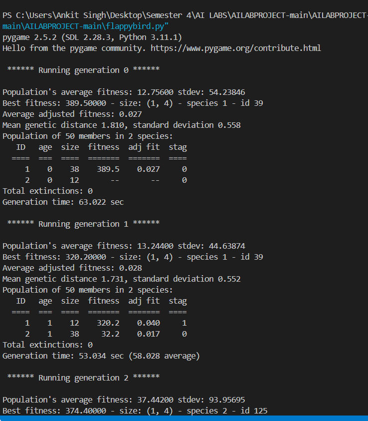
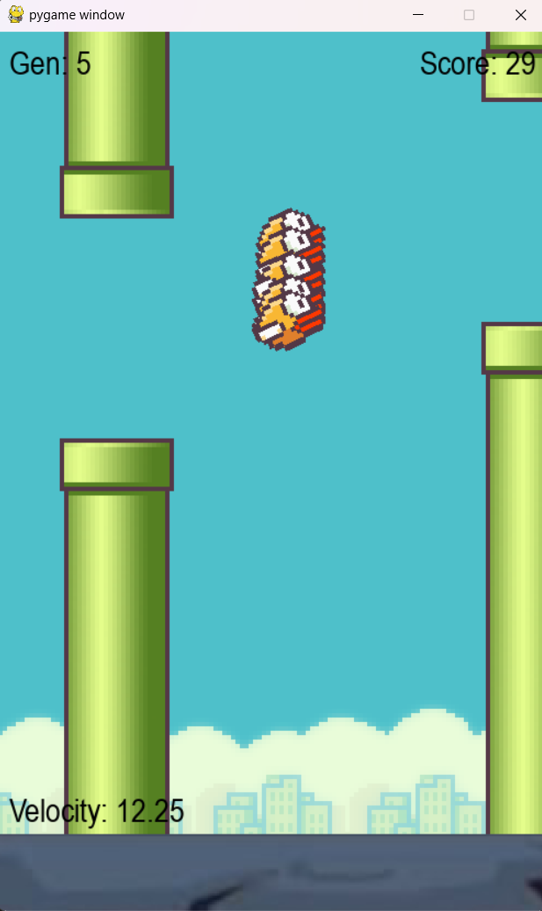
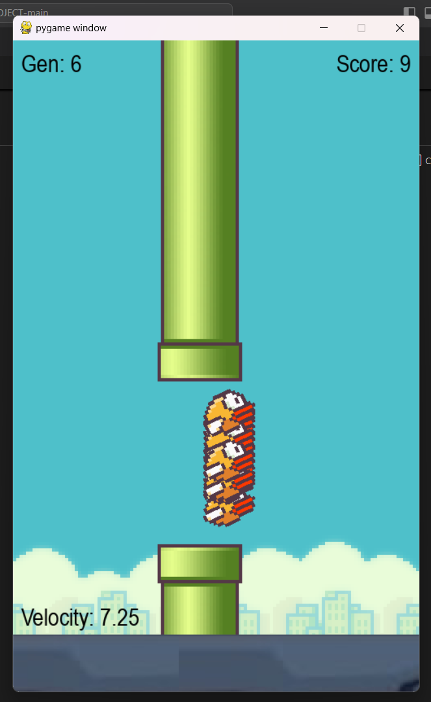

# FLAPPY AI AGENT with NEAT (Genetic Algorithm)

This project demonstrates the application of NeuroEvolution of Augmenting Topologies (NEAT) to evolve the behavior of an AI agent that plays the game "Flappy Bird". NEAT is a powerful algorithm that evolves both the structure and weights of neural networks, allowing the AI agent to progressively improve its gameplay over successive generations.

## Project Overview

In this project, the AI agent starts as a simple neural network with a minimal structure and gradually evolves to become more adept at playing the game. The evolution process is driven by three key mechanisms of the NEAT algorithm:

1. **Tracking Genes through Historical Markings**: Each connection and node in the neural network has a unique historical marker, ensuring that networks can crossbreed without losing important structural information.
2. **Speciation for Innovation Protection**: The population is divided into species based on their topological similarities, preventing premature convergence and protecting innovative topologies.
3. **Incremental Growth from Minimal Structure**: The networks begin with minimal structures, growing more complex over time through mutations that add nodes and connections.

By applying NEAT, the AI agent learns to adapt and improve its strategy through generations of evolution, ultimately mastering the game.

## Technologies Used

- **Programming Language**: Python
- **Neural Network Framework**: NEAT-Python (NeuroEvolution of Augmenting Topologies)
- **Game**: Flappy Bird (Custom implementation)
- **Visualization**: Matplotlib (for plotting performance over generations)

## Features

- Incremental evolution of neural network topologies.
- Visualization of agent performance through generations.
- Speciation mechanism to protect structural innovations.
- Adaptation of AI behavior to optimize gameplay.

## Screenshots

Below are a few screenshots :

1. **Generation 1 - Initial Performance**  
   
   
2. **INTERFACE**  
   

3. **SCREENSHOT**  
   

## Running the Project

### Prerequisites

1. **Python 3.7+**
2. Install the required packages by running:

   pip install neat-python pygame matplotlib

